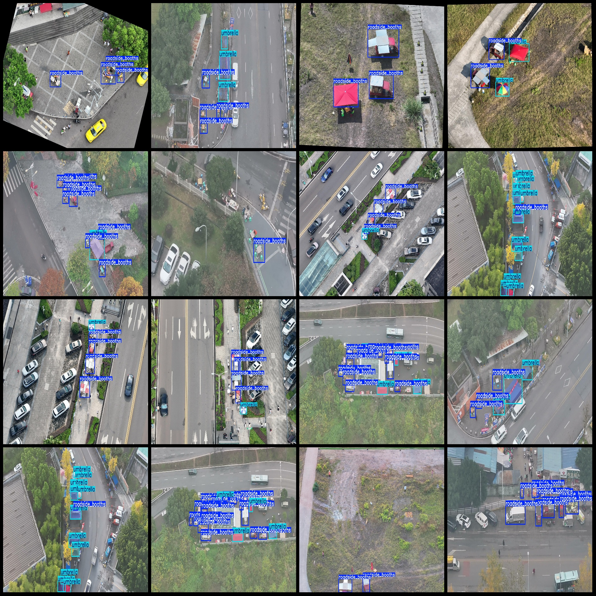
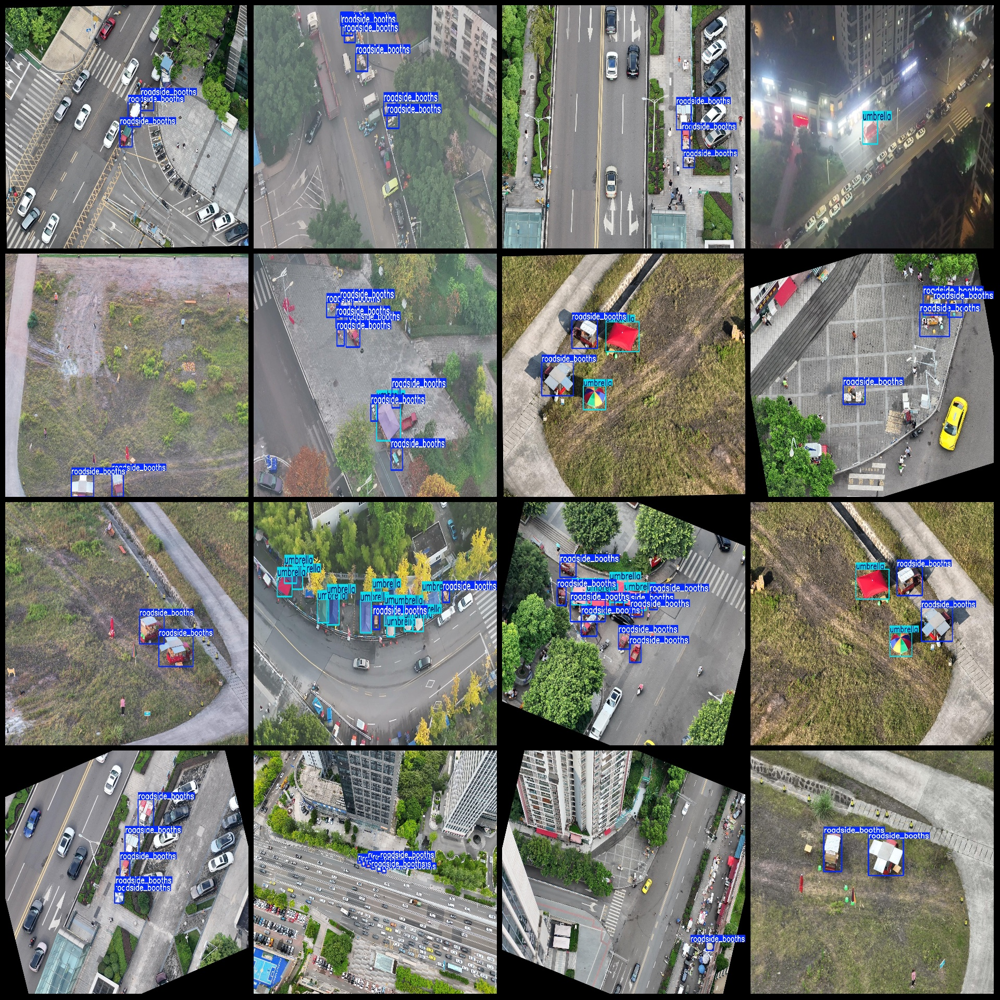

# UAV Perspective City Street Stalls and Pushcarts Detection Data Set (VOC+YOLO Format) - 355 Images in 2 Classes

Note: Some of the enhanced images in the dataset mainly include rotation enhancement.
Dataset format: Pascal VOC format + YOLO format (excluding the split path's txt file, only containing jpg images as well as corresponding VOC format xml files and yolo format txt files).
Number of images (jpg file count): 355
Number of annotations (xml file count): 355
Number of annotations (txt file count): 355
Number of annotation categories: 2
Annotation category names in YOLO format (the order may not match this list, refer to the labels folder "classes.txt" for consistency): ["roadside_booths", "umbrella"]
Number of bounding box instances per category:
- roadside_booths (Street stalls) = 1453
- umbrella (Umbrella) = 655
Total bounding box count: 2108
Image resolution: Multi-resolution images, such as 1920x1080, 1920x1440, etc.
Drone: DJI MAVIC 3
Collected height: 30m
Collected angle: 90°
Annotation tool used: labelImg
Annotation rules: Draw a rectangular bounding box for each class
Important note: No specific statement is made at this time.
Special declaration: This dataset does not guarantee the accuracy of the trained models or weight files.
Image preview:
Annotation example:

## Image

Here is a pay link on Stripe ( https://buy.stripe.com/3cs8yP7sY87d0vu9AB ). Please contact me lonlonago@foxmail.com after funding $89, and I will send you a complete data files , thank you!

